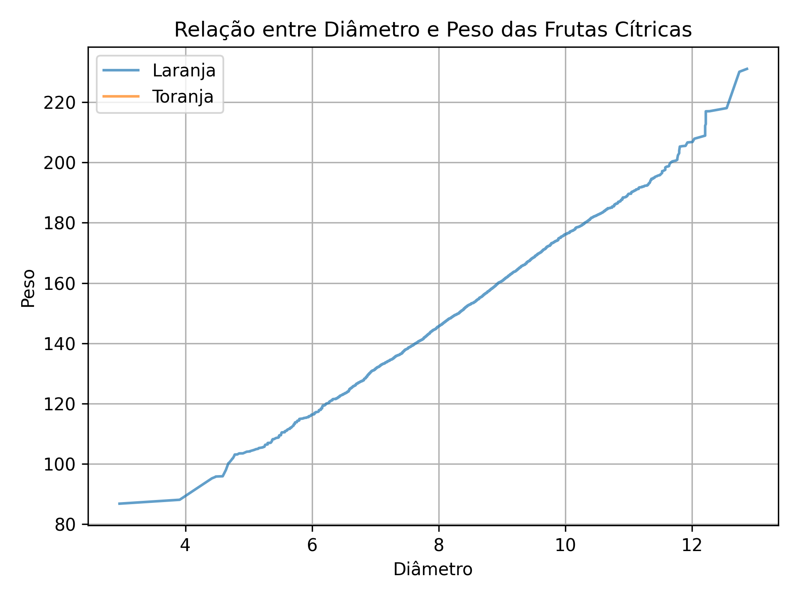

# 🍊 Citrus Data Analysis

Este projeto carrega dados de frutas cítricas (laranjas e toranjas), analisa a relação entre o **diâmetro** e o **peso**, e plota os resultados com regressão linear.

## 🔧 Tecnologias

- Python 3
- NumPy
- Matplotlib

## 📈 Resultado



## ▶️ Como executar

1. Clone o repositório:
   ```bash
   git clone https://github.com/seu-usuario/citrus-project.git
   cd citrus-project
   ```
2. Instale as dependências:
   ```
   pip install -r requirements.txt
   ```
3. Rode o script:
   ```
   python graficos_citrus.py
   ```

## 📄 Fonte dos dados
Dados disponíveis em citrus.csv.

